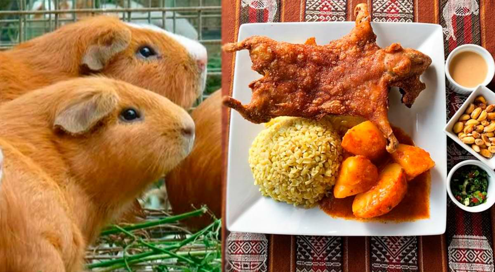

# Projecto universo cuy
### Para un mundo con mas cuys

En los ultimos años los **cuys** han sido **olvidados**, asi que la propuesta de este universo cuy es popularizarlos en la medida de lo posible.

> Ventajas de popularizar los cuys
- [X] Son animales muy bonitos y adorables
- [X] A nivel gastronómico son un plato inexplorado
- [X] Animarlos como mascota domestica


[eh aqui un documento con la instalacion de un programa de apollo](./INSTALACION.md)

Para que funciona hace falta ingresar la MAC de vuestro equipo, la cual se ve con el comando `ip addr`

Y os tiene que salir algo asi
```bash
eno1: <BROADCAST,MULTICAST,UP,LOWER_UP> mtu 1500 qdisc fq_codel state UP group default qlen 1000
    link/ether 30:c5:99:2b:69:04 brd ff:ff:ff:ff:ff:ff
    altname enp0s31f6
    inet 172.17.222.92/24 brd 172.17.222.255 scope global dynamic noprefixroute 
```
Es la parte de 30:...:ff

## A dia de hoy tenemos estas tareas hechas y pendientes
- [0] Publicitar los cuys
- [0] Promover su consumo
- [X] Demostrar lo bonitosq que son
- [X] popularizarlos

*lluisfm@* 
